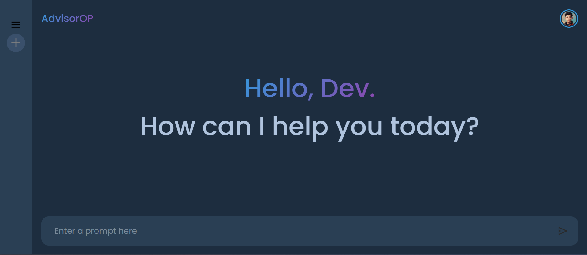

# AdvisorOP - AI Reasoning Therapist 🧠💙

A modern, interactive AI-powered therapist chatbot built with Django and React. Meet **Athena**, your AI reasoning and therapy guide who combines empathetic understanding with logical reasoning to help users explore their thoughts and feelings.



## ✨ Features

- 🤖 **AI-Powered Conversations** - Powered by Google's Gemini AI
- 🎨 **Modern Cosmic UI** - Dark, space-inspired theme with smooth animations
- 💬 **Real-time Chat** - Instant message delivery without page reloads
- 🧠 **Memory Retention** - Maintains conversation context throughout the session

## 🚀 Tech Stack

**Frontend:**
- React 18
- Vite
- CSS3 with custom animations
- Modern ES6+ JavaScript

**Backend:**
- Django 5.1.7
- Google Generative AI (Gemini)
- Python 3.11+
- SQLite Database

## 📦 Installation

### Prerequisites
- Python 3.11+
- Node.js 18+
- npm or yarn

### Backend Setup

1. **Clone the repository**
   ```bash
   git clone https://github.com/3pkm/AdvisorOP.git
   cd AdvisorOP
   ```

2. **Create virtual environment**
   ```bash
   python -m venv env
   env\Scripts\activate  # Windows
   # source env/bin/activate  # macOS/Linux
   ```

3. **Install Python dependencies**
   ```bash
   cd chatApp
   pip install -r requirements.txt
   ```

4. **Set up environment variables**
   Create a `.env` file in the project root:
   ```env
   GEMINI_API_KEY=your_gemini_api_key_here
   SECRET_KEY=your_django_secret_key
   DEBUG=True
   ```

5. **Run migrations**
   ```bash
   python manage.py migrate
   ```

6. **Start Django server**
   ```bash
   python manage.py runserver
   ```

### Frontend Setup

1. **Navigate to frontend directory**
   ```bash
   cd Frontend
   ```

2. **Install dependencies**
   ```bash
   npm install
   ```

3. **Start development server**
   ```bash
   npm run dev
   ```

4. **Open your browser**
   Visit `http://localhost:5173`

## 🎯 Usage

1. Open the application in your browser
2. Start a conversation with Athena by typing in the input field
3. Use the "New Chat" button to start fresh conversations

## 🛣️ Roadmap & TODO

### ✅ Completed Features
- [x] Basic AI chat functionality
- [x] Modern UI with dark theme
- [x] Real-time message updates
- [x] Collapsible sidebar
- [x] CSRF protection
- [x] CORS configuration
- [x] Message persistence during session

### 🔄 In Progress
- [ ] User authentication system
- [ ] Message history persistence in database
- [ ] Export chat conversations

### 📋 Upcoming Features

#### 🔐 Authentication & User Management
- [ ] User registration and login
- [ ] Password reset functionality
- [ ] User profiles and settings
- [ ] Session management

#### 💾 Data & Persistence
- [ ] Database models for conversations
- [ ] Chat history storage
- [ ] Conversation search functionality
- [ ] Data export (PDF, TXT)

#### 🎨 UI/UX Enhancements
- [ ] Theme customization (Light/Dark modes)
- [ ] Message reactions and feedback
- [ ] Typing indicators
- [ ] Sound notifications
- [ ] Custom avatars

#### 🤖 AI Improvements
- [ ] Multiple AI personas/modes
- [ ] Context-aware responses
- [ ] Mood tracking integration
- [ ] Conversation summaries
- [ ] AI response confidence indicators

#### 📱 Advanced Features
- [ ] Voice-to-text input
- [ ] Text-to-speech responses
- [ ] Mobile app (React Native)
- [ ] Push notifications

#### 🔧 Technical Improvements
- [ ] Rate limiting for API calls
- [ ] Caching layer (Redis)
- [ ] API documentation (Swagger)
- [ ] Unit and integration tests
- [ ] Docker containerization
- [ ] CI/CD pipeline
- [ ] Production deployment guide

#### 🌐 Deployment & Scaling
- [ ] Production environment setup
- [ ] Database migration to PostgreSQL
- [ ] Static file serving (AWS S3/CloudFront)
- [ ] Load balancing
- [ ] Monitoring and logging

## 🤝 Contributing

1. Fork the repository
2. Create a feature branch (`git checkout -b feature/amazing-feature`)
3. Commit your changes (`git commit -m 'Add some amazing feature'`)
4. Push to the branch (`git push origin feature/amazing-feature`)
5. Open a Pull Request

## 🙏 Acknowledgments

- Google Generative AI for powering the conversations
- React and Django communities for excellent documentation
- Contributor and testers

## 📞 Support

If you have any questions or need help:
- Open an issue on GitHub
- Contact: [jas.prakhar@gmail.com][swayamprakashpatro@gmail.com]

---

**⭐ Star this repo if you find it helpful!**
